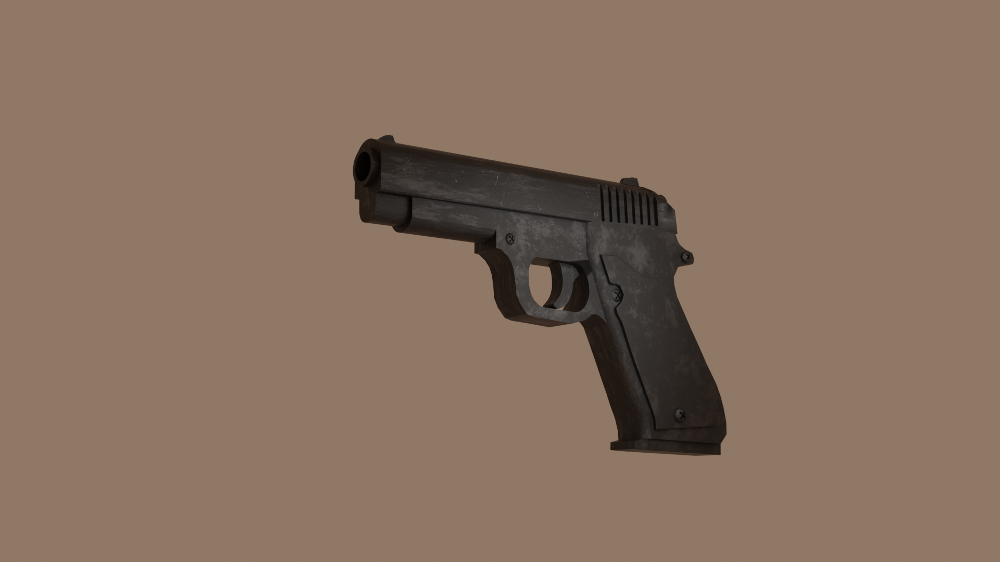
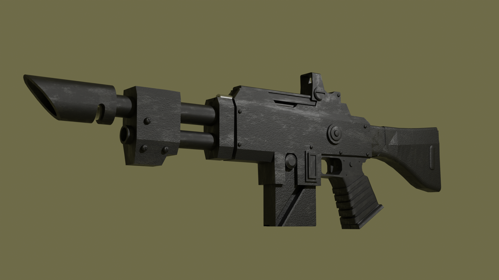
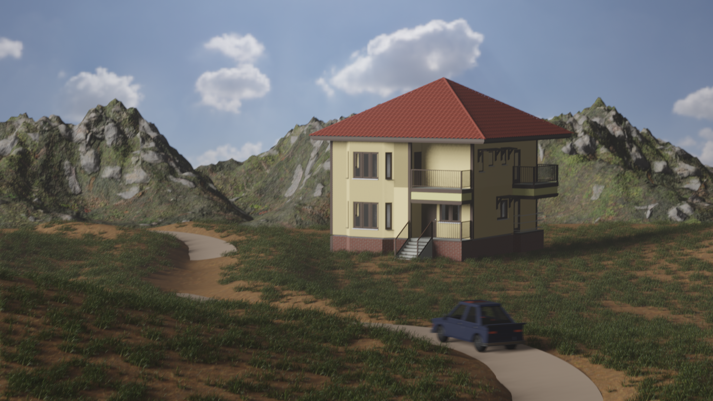
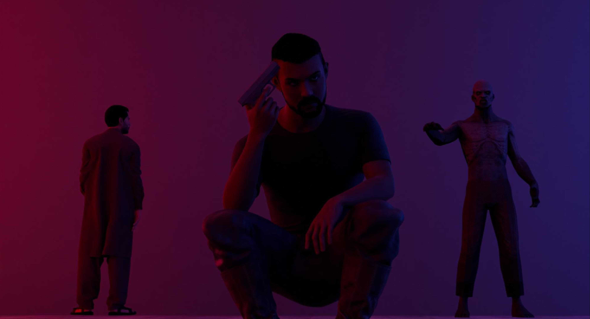
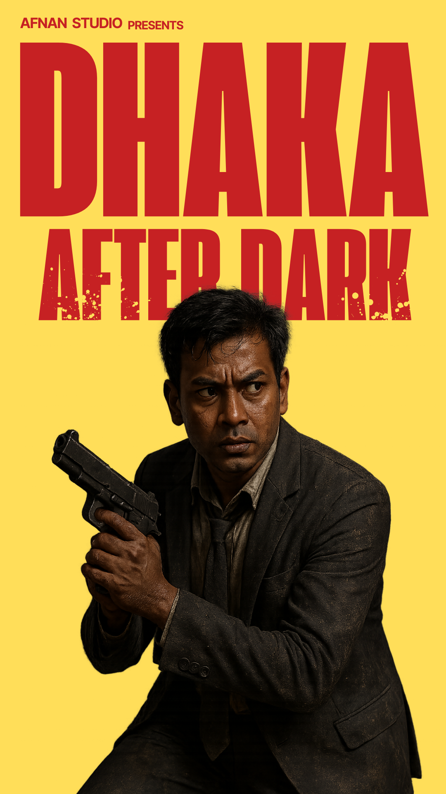

# 🎮 Kazi Afnan Alam 
**Digital Craftsmen (Game Developer/3D Modeler)**

A 3D modeler with experience working on Fiverr, creating game-ready assets and custom models. I'm also an indie game developer who has built two games from the ground up, combining my skills in design, development, and storytelling. I work primarily with Blender and Unity, and I'm always learning new tools and techniques to bring creative ideas to life.

## 🛠 Skills
- Blender (3D modeling, UV, animation)
- Unity (C#, game systems, UI, AI)
  
## My Projects
- Dhaka After Dark (horror survival game)
- Orbventure (2D platform game)
  
# My Fiverr Profile

I offer 3D modeling, asset design, and indie game art on Fiverr.

👉 Check out my Fiverr gigs here: [fiverr.com/kazi_afnan](https://www.fiverr.com/kazi_afnan)

## Sample Work

  
  
  
  

---

# Dhaka After Dark (Developed Game)

A horror survival game set in the streets of Dhaka, Bangladesh.

  
  
  

👉 [Dhaka After Dark Download(Windows)](https://github.com/yfkafnan2003/Dhaka-After-Dark/releases)

Made in Unity by Afnan Alam.
---
