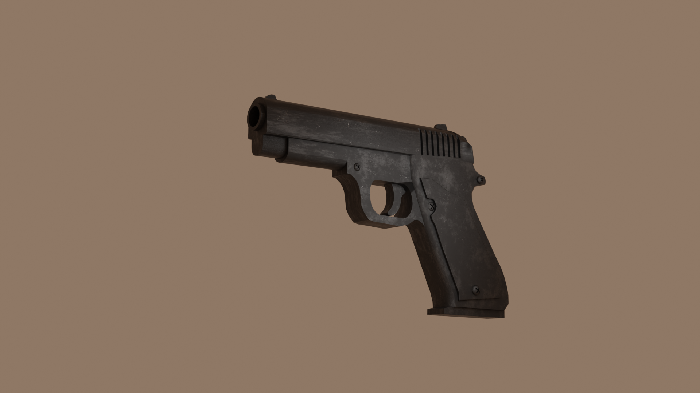
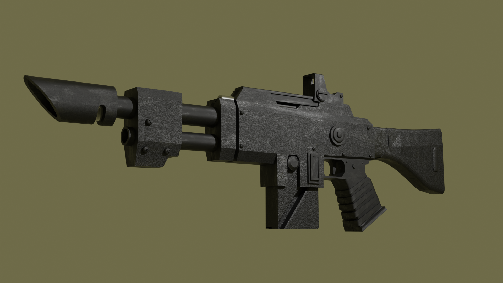
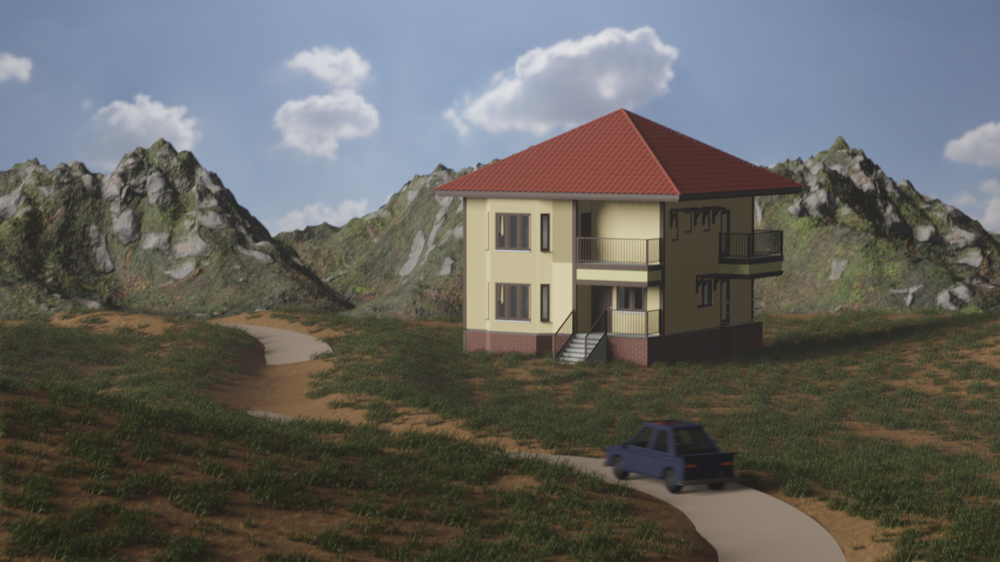
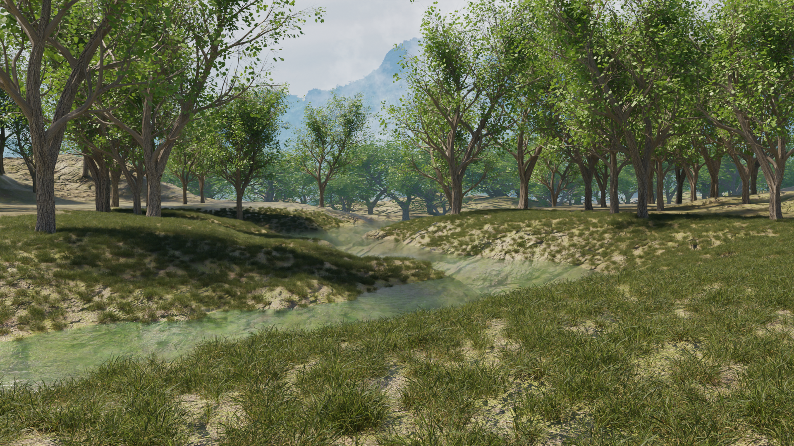

# 👨‍💻 Kazi Afnan Alam
### Game Developer | 3D Artist | Problem Solver

I am a Unity game developer and 3D artist with hands-on experience building complete games and creating game-ready assets. I also practice competitive programming to strengthen my problem-solving skills.

---

## 🧠 Competitive Programming

I actively solve problems to improve algorithmic thinking and efficiency.

- 🔗 Codeforces Profile: [https://codeforces.com/profile/afnan_179](https://codeforces.com/profile/afnan179)
- 📂 Repository: [https://github.com/yfkafnan2003/Competitive-Programming](https://github.com/yfkafnan2003/Competitive-Programming)

📌 Topics Covered:
- Data Structures
- Algorithms
- Problem Solving Techniques

---

## 🎮 Projects

### 🧟 Infection Zero (FPS Zombie Game)
- Built with Unity (C#)
- Mission system (survive, kill zombies)
- Weapon system & UI
- Mobile optimized gameplay

🔗 Repo: [https://github.com/yfkafnan2003/infection-zero-unity](https://github.com/yfkafnan2003/infection-zero-unity)

---

### 🌆 Dhaka After Dark (Horror Survival)
- атмосферic horror experience
- environment design + gameplay systems

---

### 🌀 Orbventure (2D Platformer)
- classic platform mechanics
- level design and player movement

---

## 🎨 3D Artist Journey

I create optimized 3D assets for games using Blender.

📂 3D Portfolio Repo:  
[https://github.com/yfkafnan2003/3D-Models-&-Arts](https://github.com/yfkafnan2003/3D-Models-And-Arts)

### Sample Work

  
  
  
  

---

## 💼 Work Experience

### 🎯 Fiverr (Freelance 3D Artist)
I worked as a freelance 3D artist creating custom models and game assets for clients.

🔗 Fiverr Profile:  
https://www.fiverr.com/kazi_afnan

📌 Services:
- 3D Modeling
- Game Assets
- Custom Designs

---

## 🛠 Skills

- **Game Development:** Unity, C#
- **3D Modeling:** Blender
- **Problem Solving:** Competitive Programming

---

## 📫 Contact

- Email: YOUR_EMAIL
- GitHub: https://github.com/yfkafnan2003

---

⭐ *Focused on building games, improving skills, and creating impactful digital experiences.*
