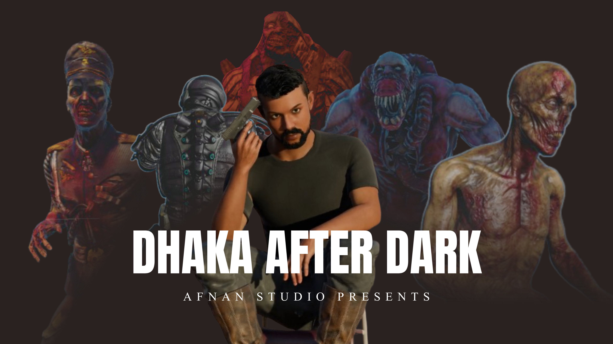
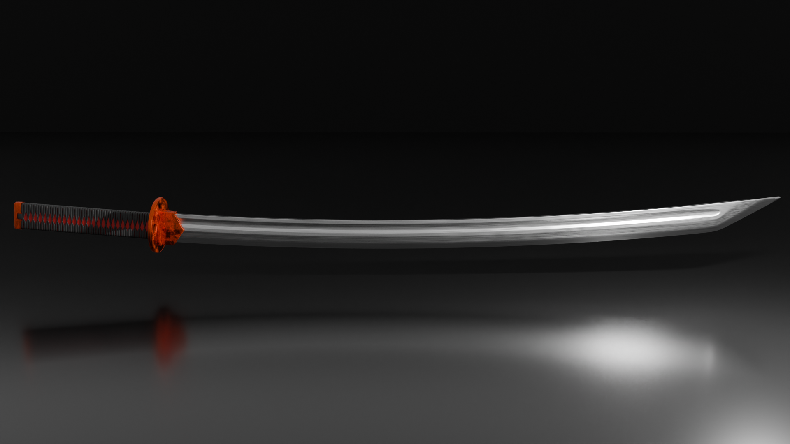
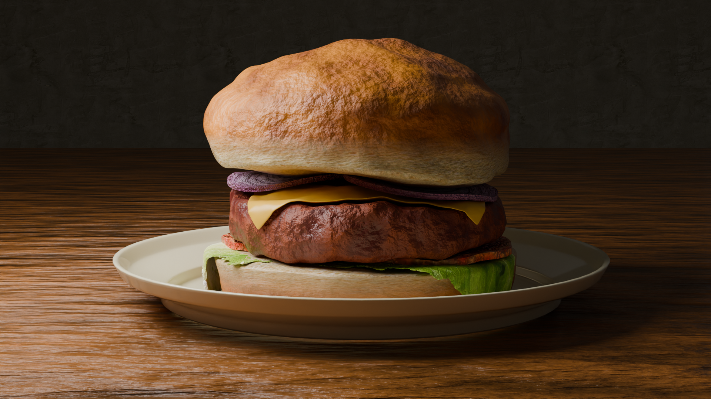
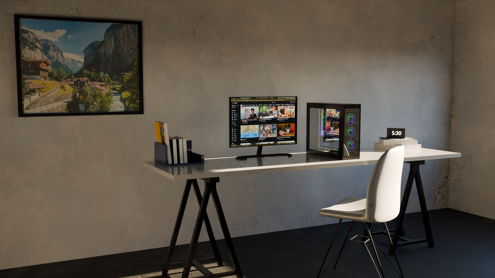
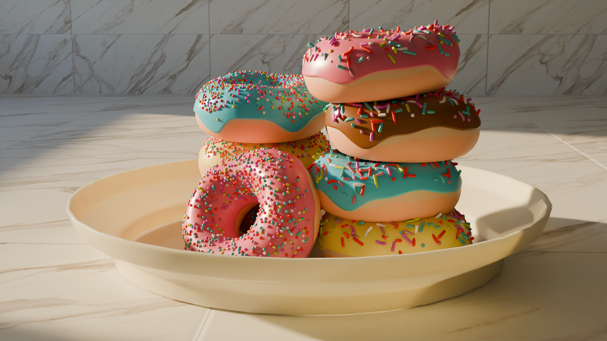

# Kazi Afnan Alam
### Game Developer | 3D Artist | Problem Solver

I am a Unity game developer and 3D artist with hands-on experience building complete games and creating game-ready assets. I work across programming, game development, 3D modeling, animation, and visual design. I also practice competitive programming to strengthen my problem-solving skills.

---

## 🎮 Game Development

### Infection Zero — FPS Zombie Survival

  

**Infection Zero** is a mobile FPS zombie survival game built with Unity and C#. Fight through waves of infected enemies, complete survival missions, manage your weapons, and survive for as long as possible.

- Unity / C#
- FPS gameplay
- Zombie AI
- Weapon system
- Mission system
- Mobile optimized gameplay

🔗 [GET IT ON GOOGLE PLAY](https://play.google.com/store/apps/details?id=com.afnan_studio.infection_zero)  
🔗 [Source Code](https://github.com/yfkafnan2003/infection-zero-unity)

---

### Dhaka After Dark — Horror Survival

  

**Dhaka After Dark** is a first-person horror survival game set in a haunting, post-apocalyptic version of Dhaka city.

- First-person horror
- Survival gameplay
- Environment design
- Gameplay systems
- Atmospheric storytelling

🔗 [PLAY ON ITCH.IO](https://afnan2003.itch.io/dhaka-after-dark)

---

## 💻 Competitive Programming

I actively solve problems to improve algorithmic thinking, programming skills, and efficiency.

- [Codeforces Profile](https://codeforces.com/profile/afnan179)
- [Competitive Programming Repository](https://github.com/yfkafnan2003/Competitive-Programming)

### Topics Covered

- Data Structures
- Algorithms
- Problem Solving Techniques

---

## 🎨 3D Artist Journey

I create optimized 3D assets, environments, and visual designs for games and other digital experiences using Blender.

[3D Models & Arts Repository](https://github.com/yfkafnan2003/3D-Models-And-Arts)

### Sample Work

  
  
  

  
  
  

  
  
  

---

## 💼 Work Experience

### Fiverr — Freelance 3D Artist

I worked as a freelance 3D artist creating custom models and game assets for clients.

[Fiverr Profile](https://www.fiverr.com/kazi_afnan)

### Services

- 3D Modeling
- Game Assets
- Custom Designs

---

## 🛠️ Skills

### Programming

- **C++**
- **C#**
- **C**
- **JavaScript**
- **HTML**
- **CSS**

### Game Development

- **Unity**
- Gameplay Programming
- Game Systems
- Mobile Game Development

### 3D & Design

- **Blender**
- 3D Modeling
- Game Asset Creation
- Animation
- Visual Design

### Problem Solving

- Competitive Programming
- Data Structures
- Algorithms

---

## 📫 Contact

- Email: YOUR_EMAIL
- GitHub: https://github.com/yfkafnan2003

---

  <i>Focused on building games, solving problems, and creating impactful digital experiences.</i>

